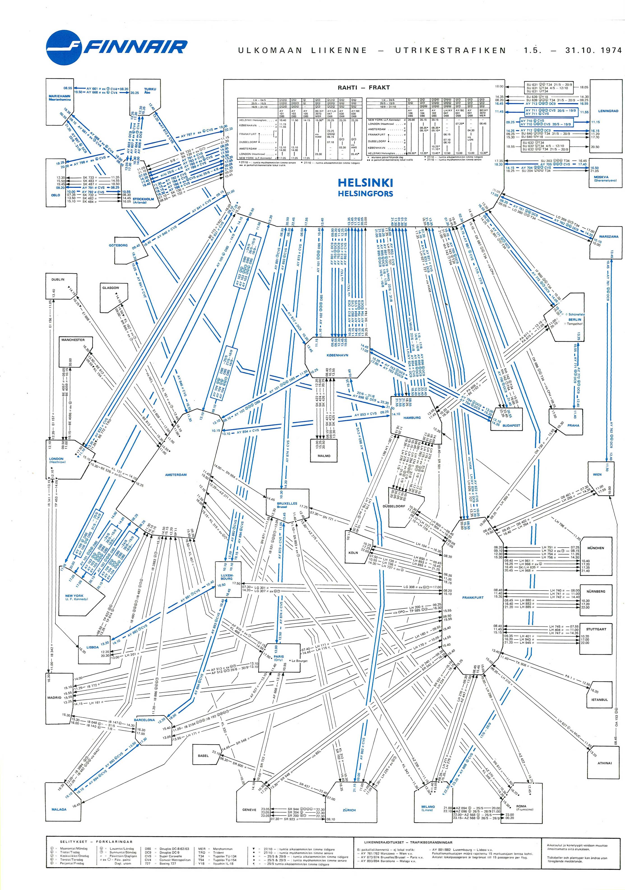
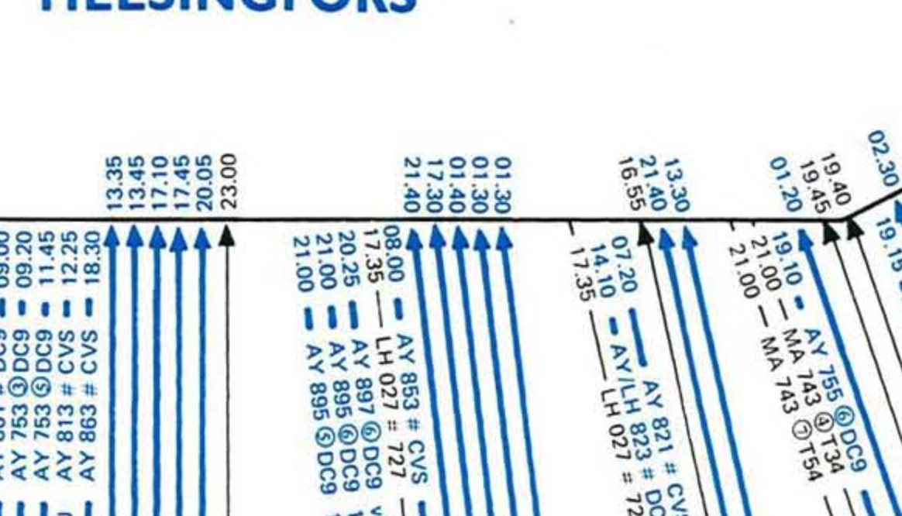

# Airline Atlas style guide

The design should feel like a carefully typeset airline timetable: compact, precise, and rich in useful information. The primary reference is the 1974 Finnair international network sheet. Preserve its parallel lanes, clear airport edges, condensed lettering, and economical use of space while supporting a modern interactive canvas.

This guide records the design decisions agreed during development. The reference scans illustrate visual treatment; they are not a source of current schedules. When exact geography competes with readability, prefer a clean, compact diagram.

The sheet is a **weekly timetable**, like the reference: one arrow per weekly service with its days of operation, not a live board of dated departures. Partner services are highlights, not an exhaustive list: only the most likely connection at each partner hub is drawn (see the README for the selection rule).

## Reference images

| Image | What to learn from it |
| --- | --- |
| [1974 international sheet](references/finnair-1974-international.png) | Overall density, large hubs, short connections, angular routes, blue/black ink, and organized crossings. |
| [Timing detail](references/finnair-1974-timing-detail.png) | Times beside individual airport ports; flight and aircraft notation along each lane; closely spaced parallel arrows. |
| [Hub crossing problem](references/hub-crossing-problem.png) | A negative example from an earlier app version: different bundles converge and cross immediately at the hub edge. Avoid this arrangement. |

See [reference provenance](references/README.md) for source information. The earlier and later full-sheet attachments were identical and are stored once.

## Composition and geography

The map fills the browser window. Filters, schedule details, and zoom controls float above it in compact, collapsible widgets. The diagram remains the main surface. Keep the paper background quiet and the controls visually related to the timetable.

The sheet itself is composed like the printed reference: a masthead (title as wordmark, letter-spaced edition line, date and counts) sits above a thin-ruled frame, the diagram fills the frame, and the explanations box sits inside the frame at the foot. Masthead and legend are scaled with sheet width (masthead by width ÷ 2300 up to 4.4×, legend by width ÷ 3000 up to 3.4×) so that they read at the Fit view even when the network is far denser than the 1974 sheet. Illustrative data is named as such in the masthead.

For the Finnair international sheet, organize the network around Helsinki:

| Side of Helsinki | Destination group |
| --- | --- |
| Left / west | Scandinavia and North America, including the US and Canada; Reykjavík belongs with the western group |
| Below / south | Other European destinations |
| Right / east | Asia |
| Above / north | Domestic Finland |

These groups also determine which edge of Helsinki the corresponding route bundles use. Within each group, geography is a soft guide. Relax local latitude and longitude order when that creates shorter connections, better spacing, or clearer crossings. Avoid forcing all destinations into a rigid geographic grid or onto one long column.

Keep distances short. Compress long-haul distances instead of leaving large empty areas between continents. A schematic does not need a basemap or exact scale. Allow modest distortion around congested airports.

## Airport boxes and hubs

Airport size communicates service volume and provides room for route ports. Helsinki may be both very wide and very tall; there is no aesthetic maximum that should force its routes back into a congested edge. Other busy airports may grow for the same reason.

- Give each route bundle its own interval on an airport edge.
- Reserve enough edge length for all lanes and their timing labels.
- Keep airport boxes separate, with clear space for approaches.
- Center the city name prominently; place the airport code and service count below it.
- Preserve a quiet interior and a thin outline. Airport boxes should read as parts of the diagram, not dashboard cards.

Boxes are eight-sided with white paper fill (`#fdfcf6`), a thin near-black outline (`#2f3631`, 1.5) and the city name in blue, as on the reference; the secondary name or code sits below in small condensed type. The corners are cut per corner from the routed bundles, as on the 1974 sheet: a corner that a bundle passes diagonally or bends around (a lane within 48 units of it) gets a large 45° cut of up to 40% of the smaller box dimension, never closer than 10 units to a port on either adjacent edge, and the router then treats that cut as passable so the lanes hug the diagonal instead of bending around a square corner; a quiet corner keeps a small 6-unit cut (8 on gateway hubs) so every box still reads as the same family. Partner-served codeshare airports use a dashed brown outline and a black name, with a `VIA LHR · British Airways` line. Gateway hubs use a heavier blue outline.

The central hub carries a single heavier rule and a city title sized to its box (about width ÷ 14, capped at 320), centred in an otherwise empty interior, as on the reference. Along its edges every route bundle carries its destination code, 54 units inside the outline just beyond the times, so the comb of lanes can be read without following each line; the code is clickable and highlights that airport's connections in place. Spoke airports do not repeat this: their one bundle leads back to the hub. A departures board inside the hub was tried and rejected: the sheet is a weekly timetable, and the edge times already carry the departures.

## Routes and crossings

Each arrow represents one flight. Flights between the same two airports share a route spine, with straight parallel lanes and consistent perpendicular spacing. Bends are sharp and geometric. Keep corresponding segments parallel through bends; do not fan individual lanes toward a shared point.

Crossings are allowed. Make them intentional and readable with a small paper-coloured break in the lower line as another route passes over it. Crossing breaks must not resemble a transfer, airport, or route endpoint. Each route draws a 7-unit paper under-stroke beneath its ink, so routes drawn later break the routes they cross. Flight labels live on a separate top layer, linked to their route by id, so a crossing never cuts through a label and hover, focus and selection light up line, times and label together.

Keep hub approaches orderly even when routes cross elsewhere: separate bundle intervals, short perpendicular approaches, and distinct arrowheads. Route around unrelated airport boxes. Do not lengthen every connection merely to eliminate crossings.

## Timetable notation

Use the notation in the timing-detail reference:

- Departure time beside the departure airport's edge.
- Arrival time beside the arrival airport's edge.
- Times written with a dot, for example **13.35**, and aligned with the corresponding lane.
- Flight number, operating days and compact aircraft code along the route, for example **AY 431 # A321** or **AY341 ①②③④⑤ AT72**, set in the route's own ink on a borderless paper plate that interrupts the line.
- Aircraft appear as timetable codes (A321, A359, E190, AT72, B738, B789); the legend lists the codes present on the sheet with their full names.
- Blue or black lettering matched to the route's ink; partner codeshares use the amber ink.

Times run along the lane, 6.5 units to one side of it, starting 11 units beyond the port outside ordinary airport boxes and 12 units inside the outline of large hubs, with a thin paper knockout so they stay legible where lanes are close. Avoid repeating both times in a long sentence at the centre of each line. Full aircraft names, dates, UTC offsets, duration, airline, and status belong in the selected-flight panel. Keep timestamps and overnight dates accurate even when the diagram shows only the local clock time.

Use only symbols supported by actual data. Do not copy historical operating-day marks, airline codes, or equipment symbols as decoration. Explain any new notation in the legend.

## Typography and colour

Use locally hosted **Oswald 600** for the brand, city names, and major headings. Use **Roboto Condensed 400/700** for times, flight labels, controls, and details. These are contemporary approximations of the reference's condensed lettering; the original typefaces have not been identified.

| Role | Current treatment |
| --- | --- |
| Paper | Warm off-white `#f8f7ef`; airport boxes `#fdfcf6` |
| Box outline | Near-black `#2f3631`, 1.5; hubs blue |
| Main blue | `#08618c`; route blue `#09618c` |
| Secondary route ink | Muted black `#454940` |
| Main text | `#303a34` |
| Rules and borders | Muted grey-green, typically `#aaa99b` |
| Partner codeshare ink | Amber `#b36200`, dashed |
| Active flight | Warm amber/brown `#cd7724` line, `#975114` text, kept distinct from normal route ink |

Use uppercase condensed city names, small timing labels, thin rules, and restrained contrast. Avoid glossy cards, rounded route curves, bright multicolour palettes, heavy shadows, or decorative map textures. Light paper texture is optional and must not compete with fine lines.

In the current app, blue solid routes indicate Finnair jets, black dashed routes indicate turboprops and amber dashed routes indicate partner-operated codeshares. This is the app's convention, not a claim about the meaning of the historical scan's colours. It follows the reference's spirit of blue for the airline's own services and a second ink for everything else.

## Working dimensions

These are current SVG drawing units, not immutable visual rules. Adjust them together when needed to preserve the character of the sheet.

| Element | Current value |
| --- | --- |
| Parallel lane spacing | 14 |
| Finnair jet route stroke | 1.8 |
| Turboprop and codeshare route stroke | 1.4, dashed |
| Paper crossing under-stroke | 7 |
| Flight label text | 11 bold, in route ink |
| Airport-edge time text | 9 bold, 1.8 paper knockout |
| Arrow endpoint gap outside airport | 8 |
| Straight approach stub | 40 before lane offsetting |
| Time label | 11 beyond the port outside small boxes, 12 inside hubs, 6.5 beside the lane |
| City name | Oswald 600, 18 |
| Hub title | width ÷ 14, capped at 320 |
| Masthead wordmark | 64 × masthead scale |

Zoom scales the whole diagram. Judge both the overall sheet and a close-up of the busiest hub. At a full-network fit, the composition should remain clear; zoom provides access to the fine timetable text.

## Interaction and accessibility

Support drag-to-pan, scroll/pinch zoom, double-click zoom, explicit zoom buttons, a 100% shortcut, and Fit. Keep keyboard panning, zoom shortcuts, focus indicators, and keyboard flight selection available.

Selecting a flight highlights its line and edge times and opens its details. De-emphasize other flights without removing the network context. Crowded central labels may appear on hover, focus, or selection. Do not use colour as the only way to distinguish the selected state or route type.

The SVG export must retain the fonts, route styles, crossing breaks, labels, and paper background. Keep reference scans out of runtime assets and exported timetable content.

## Review checklist

Before accepting a visual change, check:

- The four regional groups use the agreed sides of Helsinki.
- The hub has sufficient width and height for its ports and times.
- Nearby destinations stay compact without overlapping airport boxes.
- Parallel lanes remain evenly spaced, including at bends.
- Crossing gaps are clear, and hub approaches do not collapse into a knot.
- Departure and arrival times remain attached to the correct endpoints.
- Flight labels stay readable and do not obscure city names.
- Masthead, frame and legend are legible at Fit, and the hub interior stays quiet apart from its title.
- Zoom, selection, keyboard access, and narrow-window controls still work.
- Illustrative data is clearly labelled; the reference is not presented as live service information.

Implementation entry points: [layout and labels](../public/layout.mjs), [SVG rendering and interaction](../public/app.mjs), [styles](../public/style.css), and [layout checks](../test/layout.test.mjs).
